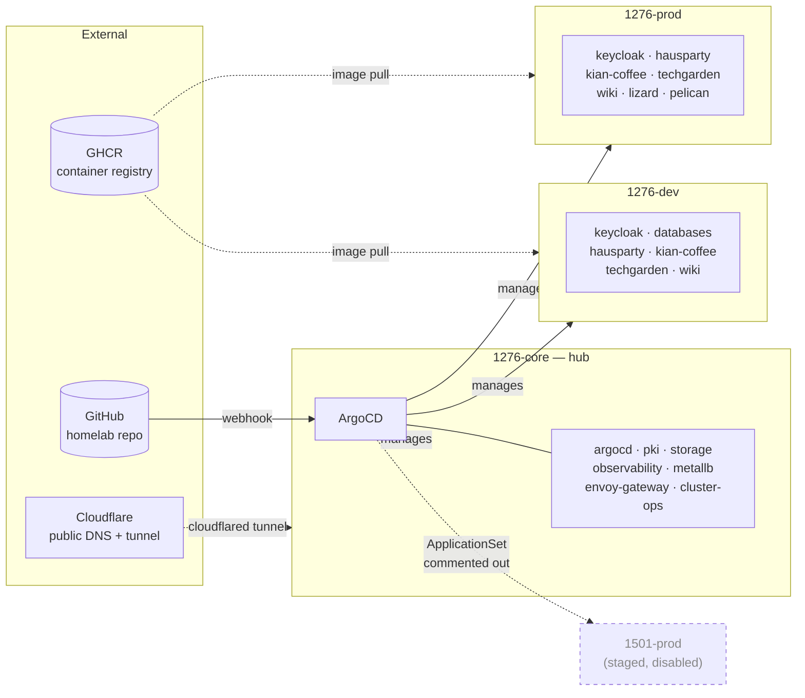
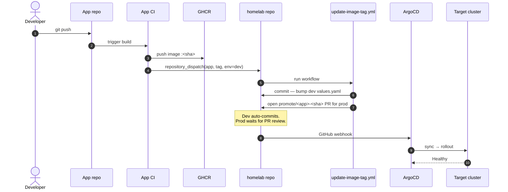

# homelab

GitOps source-of-truth for a multi-cluster Kubernetes homelab. ArgoCD reads this repo, reconciles four Talos clusters, and runs a stack of shared infrastructure (PKI, observability, storage, identity, data) alongside a handful of personal applications. Image promotions flow in automatically via `repository_dispatch` from downstream app repos; prod changes are gated behind a promotion PR.

This repo is the "app of everything" root. The parent IaC repo ([kian.sh](https://github.com/techgardencode/kian.sh), private) handles the layer below this — Proxmox, Ansible, Talos config, DNS.

---

## Architecture



**Cluster roles:**

| Cluster      | Role                                                                  |
| ------------ | --------------------------------------------------------------------- |
| `1276-core`  | Hub. Runs ArgoCD + all shared-infra Applications.                     |
| `1276-dev`   | Dev workloads. First stop for every app change.                       |
| `1276-prod`  | Primary production. Receives image tags via promotion PR after dev verifies. |
| `1501-prod`  | Secondary-AZ prod, **staged**. ApplicationSet intentionally commented out in [`argocd/apps/values.yaml`](kubernetes/clusters/1276-core/argocd/apps/values.yaml) pending cluster reactivation. Manifests remain in tree for validation. |

All four clusters are Talos. The `shared/` tree is applied to dev + prod via each ApplicationSet's git generator — cross-cutting operators (cert-manager, external-secrets, CNPG, Dragonfly, kube-state-metrics, Alloy, democratic-csi) live there once, not per-cluster.

---

## What runs here

### Platform & infra

| Area          | Components                                                                                              |
| ------------- | ------------------------------------------------------------------------------------------------------- |
| GitOps        | ArgoCD + `argocd-apps` ApplicationSet (self-managed)                                                    |
| Gateway       | Envoy Gateway (Gateway API), per-cluster Gateway resources                                              |
| Load balancer | MetalLB (L2 mode)                                                                                       |
| DNS           | external-dns → Technitium (internal, RFC 2136 / TSIG) + Cloudflare (public)                             |
| Tunnel        | cloudflared (public ingress without exposing the home IP)                                               |
| PKI           | step-ca (root), step-issuer (cert-manager integration), cert-manager                                    |
| Secrets       | external-secrets-operator + Bitwarden Secrets Manager                                                   |
| Storage       | democratic-csi → NAS: NFS (hdd/ssd) + iSCSI (hdd/ssd)                                                    |

### Data plane

| Operator       | Purpose                                        |
| -------------- | ---------------------------------------------- |
| CloudNativePG  | Postgres (hausparty, techgarden, keycloak, observability stacks) |
| Dragonfly      | Redis-compatible KV (cache, rate-limits)       |
| MySQL Operator | MariaDB for Pelican                            |
| MongoDB        | Operator for future apps                       |

### Observability

| Component                    | Role                                      |
| ---------------------------- | ----------------------------------------- |
| Alloy                        | Metrics + logs + traces collection        |
| Prometheus / Loki / Tempo    | LGTM sinks (hosted on separate VM)        |
| kube-state-metrics           | Cluster-state metrics                     |
| GlitchTip                    | Self-hosted Sentry-compatible error tracking |
| OpenPanel                    | Self-hosted product analytics             |

### Identity

Keycloak (per-cluster deployment for dev + prod), with a Keycloak instance inside `techgarden/` namespace for techgarden.gg SSO.

### Applications

| App             | Environments       | Source repo                          |
| --------------- | ------------------ | ------------------------------------ |
| kian-coffee     | dev, prod          | [kian.coffee](https://github.com/techgardencode/kian.coffee) |
| wiki            | dev, prod          | `projects/wiki`                      |
| hausparty       | dev, prod          | [hausparty](https://github.com/techgardencode/hausparty) |
| techgarden-www  | dev, prod          | `projects/techgarden/www`            |
| techgarden-bff  | dev, prod          | `projects/techgarden/bff`            |
| techgarden-blog | dev, prod          | `projects/techgarden/blog`           |
| techgarden-profile | dev, prod       | `projects/techgarden/profile`        |
| lizard          | prod               | Game server controller (Wings)       |
| pelican         | prod               | Game server panel                    |

> `1276-prod/techgarden/*` is currently excluded from the `1276-prod` ApplicationSet generator (see [`argocd/apps/values.yaml`](kubernetes/clusters/1276-core/argocd/apps/values.yaml)). Manifests exist in-tree and are validated by CI; sync is intentionally deferred.

---

## GitOps & image promotion

App repositories own their source, CI, and GHCR images. This repo owns the desired Kubernetes state. They meet at two points: `ci/app-registry.yaml` (which values file gets bumped) and a `repository_dispatch` event (the bump trigger).



- **Dev** auto-commits directly to `main`.
- **Prod** gets a `promote/<app>-<shortsha>` PR. Merging the PR deploys to prod; closing it discards the rollout.
- ArgoCD syncs within seconds of merge via a Cloudflared-tunneled GitHub webhook; the 3-minute polling interval is a fallback.
- Image tags are bot-managed. The [`.claude/` tooling in the parent repo](https://github.com/techgardencode/kian.sh) has a hook that blocks manual edits to `image:` / `tag:` / `newTag:` fields under paths registered in `ci/app-registry.yaml`.

Full bot logic: [`.github/workflows/update-image-tag.yml`](.github/workflows/update-image-tag.yml).

---

## Design decisions

Decisions are documented in [`docs/adr/`](docs/adr/). Highlights:

- **Talos** — immutable, API-driven, no SSH. Declarative cluster config versioned alongside manifests. See [ADR-0001](docs/adr/0001-talos-over-kubeadm.md).
- **ArgoCD ApplicationSet with git generator** — one source-of-truth block per cluster; apps appear simply by adding a directory under `kubernetes/clusters/<cluster>/<namespace>/<app>/`. No per-app Application YAML to maintain. See [ADR-0002](docs/adr/0002-applicationset-git-generator.md).
- **Local `generic-service` chart** — every app deploys via the same chart in [`helm-charts/generic-service/`](helm-charts/generic-service/). No per-app Helm repo, no scattered templates. See [ADR-0003](docs/adr/0003-local-generic-service-chart.md).
- **Kustomize + inline `helmCharts`** — Kustomize at the top for layering, Helm at the leaf via `kustomize build --enable-helm`. ArgoCD runs a custom `kustomize-helm` plugin. See [ADR-0004](docs/adr/0004-kustomize-with-inline-helm.md).
- **Renovate over Dependabot** — Dependabot doesn't cover Helm charts in Kustomize blocks well; Renovate does, plus it supports custom managers and versioning schemes. See [ADR-0005](docs/adr/0005-renovate-over-dependabot.md).
- **Separate `core` hub cluster** — ArgoCD and shared-tier infra live on a dedicated cluster so workload cluster failures never take GitOps offline. See [ADR-0006](docs/adr/0006-separate-core-hub-cluster.md).
- **Model-enforced prod safety gate** — `kian.sh`'s Claude Code tooling blocks direct edits to `kubernetes/clusters/*-prod/**` without verifying dev is Synced+Healthy first. See [ADR-0007](docs/adr/0007-model-as-prod-safety-gate.md).

---

## Repository layout

```
kubernetes/
├── bootstrap/              # One-time bootstrap (sealed secrets for cluster-access)
└── clusters/
    ├── shared/             # Cross-cluster operators (cert-manager, CNPG, Dragonfly, etc.)
    ├── 1276-core/          # Hub cluster — ArgoCD + platform + observability
    ├── 1276-dev/           # Dev workloads
    ├── 1276-prod/          # Primary prod workloads
    └── 1501-prod/          # Staged secondary prod (ApplicationSet disabled)

helm-charts/
├── generic-service/        # Standard app chart — deployment, service, HTTPRoute, HPA, ExternalSecret
└── namespace/              # Namespace bootstrap (NetworkPolicy + RBAC)

ci/
└── app-registry.yaml       # App name → manifest paths. Consumed by update-image-tag.yml.

.github/workflows/
├── validate-and-audit.yml  # Per-cluster kustomize build + helm template on PR + push
└── update-image-tag.yml    # repository_dispatch handler for image promotions

docs/
├── architecture.md         # Expanded architecture per concern
├── adr/                    # Architecture decision records
└── runbooks/               # Operator procedures (links to parent-repo skills)

renovate.json               # Dependency updates (weekdays before 6am)
scripts/                    # Manual utilities (sealed-secret creation, etc.)
```

---

## Operating model

### Adding a new app

1. Add directory: `kubernetes/clusters/<cluster>/<namespace>/<app>/`
2. Drop a `kustomization.yaml` (with `helmCharts:` referencing `helm-charts/generic-service/` or a remote chart) and `values.yaml`
3. Commit. The ApplicationSet git generator discovers it on next ArgoCD sync.
4. (Optional) Register in `ci/app-registry.yaml` to enable CI-driven image tag bumps.

### Prod safety gate

- ArgoCD auto-syncs prod from `main`. There is no manual gate at the cluster level.
- The gate is enforced upstream: the parent repo's tooling ensures dev is `Synced + Healthy` before a prod change can merge, and `update-image-tag.yml` opens a promotion PR rather than pushing to prod directly.

### Secrets

- No plaintext secrets in this repo.
- External Secrets Operator syncs from Bitwarden Secrets Manager (`ClusterSecretStore`).
- The one-time bootstrap sealed secret (for initial cluster-access + BSM credentials) lives in `kubernetes/bootstrap/secrets/` and is gitignored.

### Validation

Every PR runs:

- `kustomize build --enable-helm` for every Application dir in every cluster (matrix over `1276-core`, `1276-dev`, `1276-prod`, `1501-prod`, `shared`)
- `helm template` for both local charts

If main breaks post-merge (e.g. Renovate auto-merge introduces an incompatibility), a GitHub issue is auto-created.

### Dependency updates (Renovate)

- Schedule: weekday before 6am.
- Auto-merged: patch Helm bumps, digest/pin updates, and `ghcr.io/techgardencode/*` image digests.
- Held for review (label `manual-review`): minor/major Helm bumps.
- Pinned: `keycloak < 25.0.0`, `redis < 1.0.0` (deferred major upgrades).

See [`renovate.json`](renovate.json).

---

## Related

- [kian.sh](https://github.com/techgardencode/kian.sh) — parent IaC repo (Proxmox, Talos, Ansible, DNS). This repo is a submodule of it.
- [wiki.techgarden.gg](https://github.com/techgardencode/wiki) — long-form infra and architecture docs.

## License

[MIT](LICENSE).
