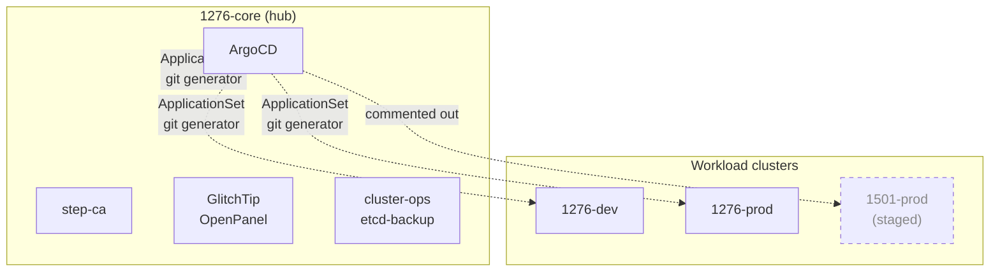
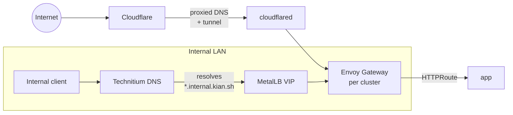
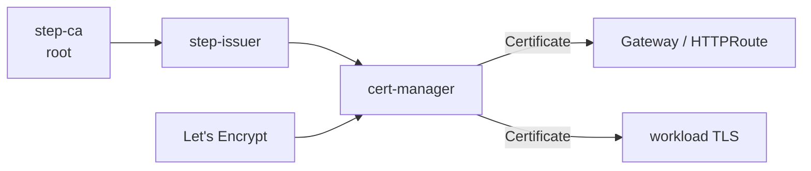
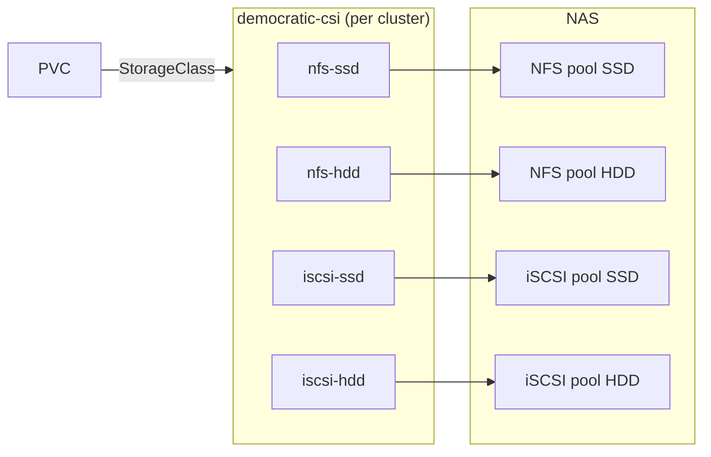
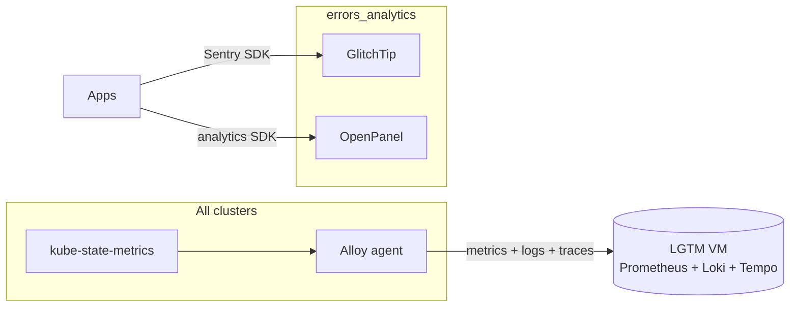

# Architecture

Expanded view of the homelab's Kubernetes platform. Start with the [README](../README.md); this doc drills into each plane.

## Cluster topology

All four clusters are Talos. ArgoCD runs only on `1276-core`, targeting the other clusters via registered cluster credentials. Workload clusters never host GitOps tooling — a blast-radius decision (see [ADR-0006](adr/0006-separate-core-hub-cluster.md)).

## ApplicationSet wiring

The root `argocd-apps` chart ([`kubernetes/clusters/1276-core/argocd/apps/`](../kubernetes/clusters/1276-core/argocd/apps/)) defines three active ApplicationSets (and one commented-out `1501-prod`):

| ApplicationSet | Target              | Generator paths                                                                 |
| -------------- | ------------------- | ------------------------------------------------------------------------------- |
| `1276-core`    | `in-cluster`        | `shared/**/*` + explicit `1276-core/{argocd,metallb,envoy-gateway,storage,pki,cluster-ops,platform,observability}/*` |
| `1276-dev`     | remote `1276-dev`   | `shared/**/*` + `1276-dev/**/*`                                                 |
| `1276-prod`    | remote `1276-prod`  | `shared/**/*` + `1276-prod/**/*` (excluding `1276-prod/techgarden/*`)          |
| `1501-prod`    | —                   | Commented out                                                                   |

The generator derives Application names as `{cluster}.{namespace}.{basenameNormalized}` where `{namespace}` is the 4th path segment (`kubernetes/clusters/<cluster>/<namespace>/<app>`). Namespace is passed to the `kustomize-helm` plugin so all resources land in the right namespace even without an explicit `namespace:` in `kustomization.yaml`.

Sync policy is uniform: `automated`, `selfHeal: true`, `prune: true`, `ApplyOutOfSyncOnly=true`, `ServerSideApply=true`.

## Networking & gateway

- Public traffic ingresses via Cloudflare → cloudflared tunnel → Envoy Gateway.
- Internal traffic resolves through Technitium (3 replicas, AXFR-replicated) → MetalLB L2 VIPs → Envoy Gateway.
- `external-dns` writes records from `HTTPRoute` + `Service` annotations to both providers (Cloudflare for public hostnames, Technitium via RFC 2136 TSIG for internal).

## PKI

- `step-ca` on `1276-core` issues certs for `*.internal.kian.sh` (internal CA).
- `cert-manager` routes: `step-issuer` for internal hostnames, ACME (Let's Encrypt DNS-01 via Cloudflare) for public.
- Root CA distributed to Talos nodes via machine config.

## Storage

Four `StorageClass`es per cluster (nfs-ssd, nfs-hdd, iscsi-ssd, iscsi-hdd). RWX workloads use NFS; databases and single-writer workloads use iSCSI. Critical services (step-ca) have historically gone read-only on NAS power loss — a known iSCSI semantics issue tracked in runbooks.

## Data plane

- **Postgres**: CloudNativePG operator in `cnpg-system` (shared). Per-app `Cluster` resources in the app's namespace. Backups to NFS.
- **Dragonfly** (Redis-compatible): Operator v1.5.0 in `db-operators`. Small instances pin `--proactor_threads=1`.
- **MySQL/MariaDB**: operator-managed, currently only Pelican uses it.
- **Mongo**: operator deployed, no workloads yet.

Dev DB hostnames follow `db.<app>.dev.<domain>` with per-DB MetalLB LB services (no port-forwarding required for dev tooling).

## Observability

LGTM stack runs on a separate VM (outside K8s) to keep monitoring independent of cluster failures. GlitchTip and OpenPanel run on `1276-core` with CNPG-backed storage.

## Identity

Keycloak runs per workload cluster (dev + prod). A separate branded Keycloak lives in `techgarden/` namespace for `techgarden.gg` SSO. All realms and clients are managed declaratively via Keycloak Config CLI in initContainers.

## Bootstrap order

New clusters hit a well-known chicken-and-egg: cert-manager and external-secrets both depend on the other's CRDs being present before their own controllers can reconcile. The `shared/cert-manager` and `shared/external-secrets` kustomizations use ArgoCD sync waves and PreSync hooks to break the cycle (see [`feedback_argocd_hook_externalsecret_race`](https://github.com/techgardencode/kian.sh) in the parent repo's tooling).

Bootstrap sealed secret for ArgoCD cluster-access + BSM credentials lives in `kubernetes/bootstrap/` and is applied once via `kubectl apply -k`. After that, ArgoCD self-manages.
